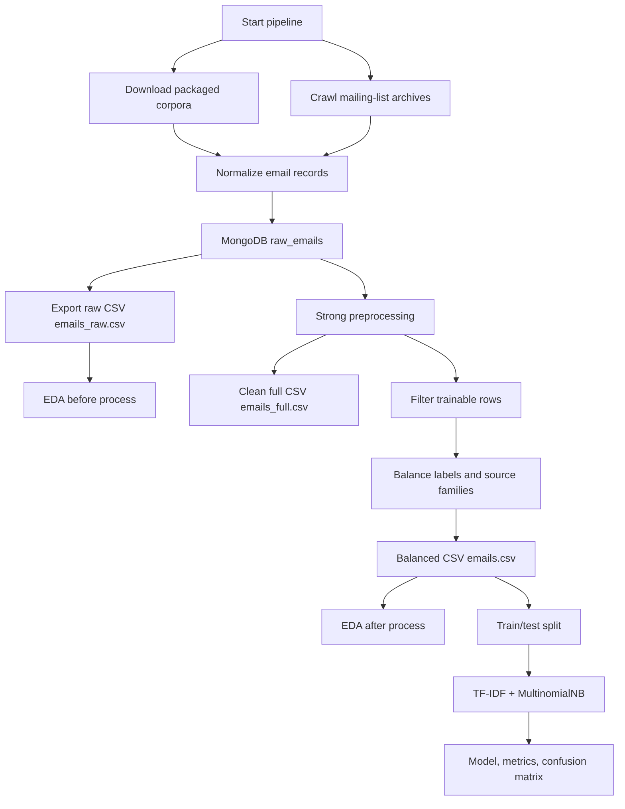
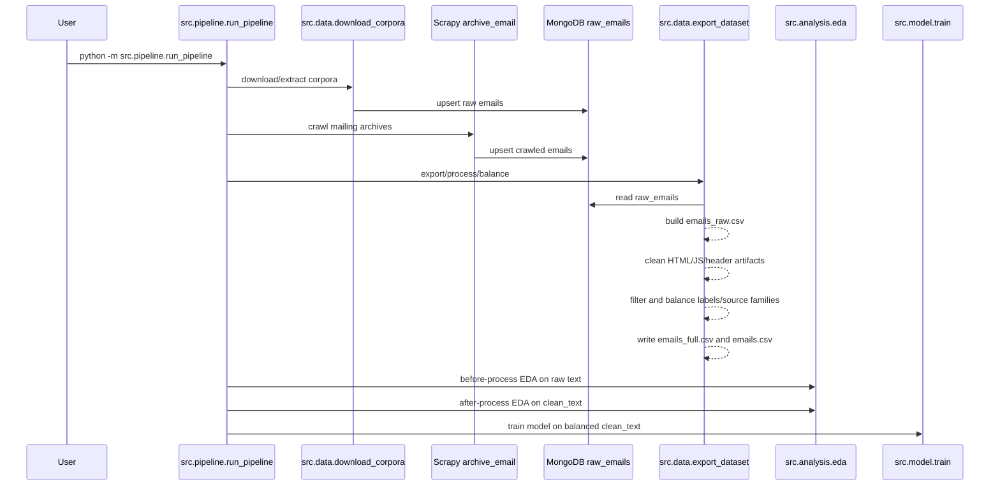
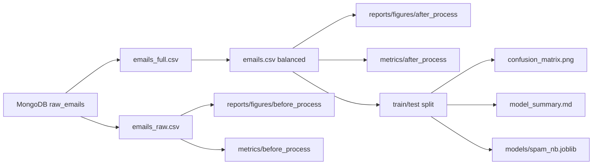

# V1 Pipeline: Email Spam Classification

Tài liệu này mô tả flow hiện tại của project: download/crawl dữ liệu email, lưu MongoDB, export raw data, xử lý mạnh, cân bằng dữ liệu, EDA trước/sau process, train model và lưu toàn bộ output cần nộp/kiểm tra.

## Mục Tiêu

- Thu thập dữ liệu spam/ham từ nhiều nguồn.
- Tách rõ nguồn download sẵn và nguồn phải crawl.
- Lưu raw email vào MongoDB để có thể chạy lại pipeline mà không mất dữ liệu.
- Tạo dataset raw để EDA trước khi xử lý.
- Tạo dataset đã clean mạnh và balance tốt để EDA sau xử lý và train.
- So sánh before/after processing bằng hình trong `reports/figures`.
- Train model phân loại spam/ham bằng TF-IDF + Multinomial Naive Bayes.
- Ghi log ngắn gọn vào `PIPELINE.log`, lỗi vào `ERRORS.log`.

## Sơ Đồ Tổng Quan



## Full Pipeline Command

```bash
.venv/bin/python -m src.pipeline.run_pipeline
```

`src.pipeline.run_pipeline` chạy 7 bước:

```text
[1/7] download corpora
[2/7] crawl archives
[3/7] validate crawl
[4/7] export/process/balance
[5/7] EDA before process
[6/7] EDA after process
[7/7] train model
```

Chi tiết command thật:

```bash
.venv/bin/python -m src.data.download_corpora
.venv/bin/python -m scrapy crawl archive_email
.venv/bin/python -m src.validate_crawl
.venv/bin/python -m src.data.export_dataset
.venv/bin/python -m src.analysis.eda --input data/processed/emails_raw.csv --figures reports/figures/before_process --metrics data/processed/metrics/before_process --stage before_process --text-column text
.venv/bin/python -m src.analysis.eda --input data/processed/emails.csv --figures reports/figures/after_process --metrics data/processed/metrics/after_process --stage after_process --text-column clean_text
.venv/bin/python -m src.model.train
```

## Cấu Hình `.env`

```env
MONGO_URI=mongodb://localhost:27017
DB_NAME=email_spam_lab
CORPUS_BATCH_SIZE=1000
CRAWL_DELAY_SECONDS=0.5
DOWNLOAD_TIMEOUT_SECONDS=60
BALANCE_DATASET=true
BALANCE_MAX_PER_SOURCE_FAMILY=1000
BALANCE_RANDOM_SEED=42
MIN_CLEAN_WORDS=5
MIN_CLEAN_CHARS=25
HF_TOKEN=your_huggingface_token
```

Ghi chú:

- `HF_TOKEN` là optional nhưng nên có để Hugging Face tải nhanh hơn và ít bị rate limit.
- Không ghi giá trị thật của token vào docs, report, log hoặc notebook.
- `CRAWL_DELAY_SECONDS=0.5` đang dùng cho thử nghiệm nhanh.
- `BALANCE_DATASET=true` nghĩa là `emails.csv` sẽ là dataset đã balance để train.

## Nguồn Dữ Liệu

### Direct Download/Extract

File cấu hình: `config/corpora_sources.json`.

Các nhóm nguồn:

- SpamAssassin public corpus:
  - easy ham
  - hard ham
  - spam
  - spam_2
- AUEB Enron-Spam:
  - `enron1` đến `enron6`
  - label lấy theo path `ham`/`spam`
  - mỗi nguồn cap khoảng `500 ham + 500 spam`
- Kaggle:
  - `purusinghvi/email-spam-classification-dataset`
  - `wcukierski/enron-email-dataset`
- Hugging Face:
  - `SetFit/enron_spam`
  - `KimDongH/spam_dataset`
  - `farshad72/spam_email`

Direct sources được download/extract nhanh, không dùng Scrapy và không sleep từng email.

### Scrapy Crawl

File cấu hình: `config/crawler_sources.json`.

Các nhóm crawl:

- LKML:
  - `lkml_2022_10_week_1`
  - `lkml_2024_02_week_3`
- FreeBSD 2025:
  - `freebsd_questions_2025`
  - `freebsd_hackers_2025`
  - `freebsd_current_2025`
  - `freebsd_stable_2025`
  - `freebsd_ports_2025`

Scrapy chỉ dùng cho archive page cần crawl. Các source lớn dùng `sample_strategy: even` để lấy đều trên toàn archive thay vì lấy dồn phần đầu.

## MongoDB ELT

Collection mặc định:

```text
email_spam_lab.raw_emails
```

Record được upsert bằng `email_id`, nên chạy lại pipeline không nhân đôi dữ liệu. Nếu Ctrl+C rồi chạy lại:

- File đã tải xong sẽ dùng cache.
- MongoDB upsert tránh duplicate.
- Export/process/EDA/train có thể chạy lại từ MongoDB.

Kiểm tra dữ liệu:

```bash
.venv/bin/python -m src.data.check_data
```

## Data Flow Chi Tiết



## Export Output

`src.data.export_dataset` tạo 3 CSV chính:

```text
data/processed/emails_raw.csv
data/processed/emails_full.csv
data/processed/emails.csv
```

Ý nghĩa:

- `emails_raw.csv`: dữ liệu raw sau merge và drop duplicate nhẹ theo raw `text + label`; dùng cho EDA before process.
- `emails_full.csv`: toàn bộ dữ liệu đã clean mạnh; dùng để audit, kiểm tra mất mát sau processing.
- `emails.csv`: dữ liệu đã clean mạnh, filter trainable rows, balance label/source; dùng cho EDA after process và train.

Report đi kèm:

```text
data/processed/metrics/preprocessing_balance_report.md
```

Report này ghi:

- số row trước/sau clean
- số row trainable
- label distribution trước/sau balance
- source family contribution trước/sau balance
- HTML/script artifact reduction

## Strong Preprocessing

Module chính: `src/data/preprocess_balance.py`.

Các bước xử lý:

- Ghép `subject + body` thành `text`.
- Parse và loại HTML tag.
- Bỏ `<script>`, `<style>`, `noscript`.
- `html.unescape` nhiều lần để xử lý entity lồng nhau.
- Cleanup quoted-printable line break.
- Normalize URL thành token trung gian rồi loại khỏi vocabulary.
- Normalize email address thành token trung gian rồi loại khỏi vocabulary.
- Normalize số, hash dài, hex string.
- Xóa punctuation nhiễu.
- Lowercase.
- Tokenize lại bằng regex.
- Bỏ token quá ngắn.
- Bỏ stopword tiếng Anh.
- Bỏ artifact từ email header, HTML, JavaScript, dataset.

Ví dụ artifact bị xử lý:

```text
font, br, nbsp, td, href, html, script, javascript,
http, www, com, escapenumber, escapelong, numbertoken,
urltoken, hextoken, emailtoken
```

Output text sạch nằm ở cột:

```text
clean_text
```

## Balance Data

Mục tiêu balance:

- Tổng `ham` và `spam` xấp xỉ bằng nhau.
- Không để một source lớn nuốt toàn bộ dataset.
- Giữ nhiều source family nhất có thể.
- Không ép source ham-only phải có spam giả.

Logic:

1. Gộp source family:
   - tất cả `spamassassin_*` thành `spamassassin`
   - các source khác giữ tên riêng
2. Filter row trainable:
   - `clean_word_count >= MIN_CLEAN_WORDS`
   - `clean_char_count >= MIN_CLEAN_CHARS`
   - label phải là `ham` hoặc `spam`
3. Cap mỗi source family theo `BALANCE_MAX_PER_SOURCE_FAMILY`.
4. Tính label nhỏ hơn giữa `ham` và `spam`.
5. Sample đều theo source family trong từng label.
6. Shuffle bằng `BALANCE_RANDOM_SEED`.

Vì LKML, FreeBSD, Kaggle Enron là ham-only, chúng không thể tự balance ham/spam nội bộ. Pipeline xử lý bằng cách giảm số ham từ các nguồn ham-only và lấy spam đều từ các source spam-capable.

## EDA Before/After

EDA được tách thành 2 stage.

### Before Process

Input:

```text
data/processed/emails_raw.csv
```

Text column:

```text
text
```

Output hình:

```text
reports/figures/before_process/
```

Output metrics:

```text
data/processed/metrics/before_process/
```

Mục đích:

- Nhìn raw data bẩn như thế nào.
- Thấy HTML artifact, script artifact, dataset artifact.
- Kiểm tra source/label distribution trước clean và balance.

### After Process

Input:

```text
data/processed/emails.csv
```

Text column:

```text
clean_text
```

Output hình:

```text
reports/figures/after_process/
```

Output metrics:

```text
data/processed/metrics/after_process/
```

Mục đích:

- Kiểm tra data sau clean và balance.
- So sánh wordcloud spam/ham sau khi artifact đã bị loại.
- Kiểm tra source contribution sau balance.
- Kiểm tra length distribution sau processing.

### EDA Figures

Mỗi stage tạo:

```text
label_distribution.png
source_family_distribution.png
source_family_label_distribution.png
top_words_wordcloud.png
ham_wordcloud.png
spam_wordcloud.png
text_length_boxplots.png
text_shape_scatter.png
```

Stage after-process có thêm:

```text
raw_vs_clean_length_scatter.png
```

Quy ước:

- `reports/` chỉ chứa hình.
- CSV, markdown, JSON metrics nằm trong `data/processed/metrics/`.

## Train/Test Và Model

Module chính: `src/model/train.py`.

Input:

```text
data/processed/emails.csv
```

Text dùng train:

```text
clean_text
```

Split:

- `test_size=0.2`
- `random_state=42`
- ưu tiên stratify theo `source + label`
- fallback về label-only nếu group quá nhỏ

Model:

```text
TfidfVectorizer(stop_words=strong_stopwords, min_df=2, ngram_range=(1, 2))
MultinomialNB()
```

Baseline:

```text
DummyClassifier(strategy="most_frequent")
```

Output:

```text
models/spam_nb.joblib
reports/figures/confusion_matrix.png
data/processed/metrics/classification_report.txt
data/processed/metrics/train_test_distribution.csv
data/processed/metrics/per_source_classification_report.csv
data/processed/metrics/cross_source_holdout_report.csv
data/processed/metrics/model_summary.md
```

Quan trọng khi phân tích:

- Accuracy random split không đủ để kết luận model tốt.
- Cần đọc `cross_source_holdout_report.csv` để xem model có chịu được source shift không.
- Cần đọc `train_test_distribution.csv` để biết mỗi source đóng góp bao nhiêu vào train/test.

## Logging

Log chính:

```text
PIPELINE.log
```

Log lỗi:

```text
ERRORS.log
```

Thiết kế hiện tại:

- `PIPELINE.log` ngắn gọn, chỉ ghi step chính và summary.
- Các log lặp theo từng email/file/request đã hạ xuống `DEBUG`.
- `ERRORS.log` chỉ ghi lỗi.
- HF warning không quan trọng đã được suppress.
- Nếu có `HF_TOKEN`, Hugging Face request sẽ dùng authenticated token.

Theo dõi:

```bash
tail -f PIPELINE.log
tail -f ERRORS.log
```

## Resume Và Chạy Lại

Nếu Ctrl+C giữa pipeline:

- Direct download dùng cache file đã tải.
- MongoDB upsert theo `email_id`, không duplicate record.
- Export/EDA/train có thể chạy lại riêng.
- Nếu muốn reset hoàn toàn thì xóa MongoDB collection hoặc data folder theo chủ đích.

Chạy riêng từng bước:

```bash
.venv/bin/python -m src.data.download_corpora
.venv/bin/python -m scrapy crawl archive_email
.venv/bin/python -m src.validate_crawl
.venv/bin/python -m src.data.export_dataset
.venv/bin/python -m src.analysis.eda --input data/processed/emails_raw.csv --figures reports/figures/before_process --metrics data/processed/metrics/before_process --stage before_process --text-column text
.venv/bin/python -m src.analysis.eda --input data/processed/emails.csv --figures reports/figures/after_process --metrics data/processed/metrics/after_process --stage after_process --text-column clean_text
.venv/bin/python -m src.model.train
```

## File/Module Map

| Path | Vai trò |
|---|---|
| `src/pipeline/run_pipeline.py` | Orchestrate full 7-step pipeline |
| `src/data/download_corpora.py` | Download/extract packaged corpora and save to MongoDB |
| `src/email_spam/spiders/archive_email.py` | Scrapy spider for LKML/FreeBSD archive crawl |
| `src/email_spam/pipelines.py` | Save crawled items to MongoDB |
| `src/email_utils.py` | Parse raw email/html email into normalized item |
| `src/data/export_dataset.py` | Export raw, clean full, balanced train CSV |
| `src/data/preprocess_balance.py` | Strong text cleaning and balancing logic |
| `src/analysis/eda.py` | EDA before/after processing |
| `src/model/train.py` | Train/evaluate Naive Bayes model |
| `src/model/predict.py` | Predict one input string using saved model |
| `src/validate_crawl.py` | Validate crawl summary has data |
| `src/data/check_data.py` | Check MongoDB and CSV output locations |
| `src/common/error_logging.py` | Configure `PIPELINE.log` and `ERRORS.log` |

## Output Tree

```text
data/
  raw/downloads/
  processed/
    emails_raw.csv
    emails_full.csv
    emails.csv
    metrics/
      before_process/
      after_process/
      preprocessing_balance_report.md
      classification_report.txt
      train_test_distribution.csv
      per_source_classification_report.csv
      cross_source_holdout_report.csv
      model_summary.md

reports/
  figures/
    before_process/
    after_process/
    confusion_matrix.png

models/
  spam_nb.joblib
```

## Current Verified Snapshot

Snapshot gần nhất sau khi chạy export/process/balance:

```text
emails_raw.csv: 17967 rows
emails_full.csv: 17582 rows
emails.csv: 8940 rows
ham: 4470
spam: 4470
```

Model snapshot gần nhất:

```text
accuracy: about 0.98
baseline: about 0.50
ham f1: about 0.98
spam f1: about 0.98
```

Không dùng chỉ số này một mình để kết luận. Khi viết analysis, phải kèm:

- before/after EDA
- source contribution
- train/test distribution
- cross-source holdout
- rủi ro source leakage và artifact leakage

## Mermaid: Output Dependency


